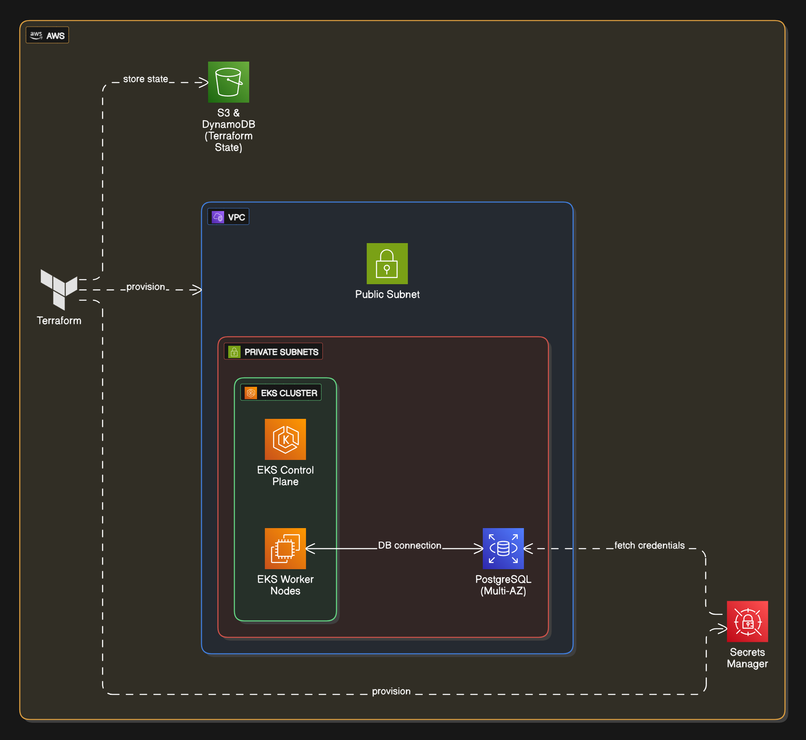

# Production Grade Kubernetes & PostgresSQL Infrastructure with Terraform

This project demonstrates how to deploy a **secure, production-ready Kubernetes (EKS) cluster and a PostgreSQL database (RDS)** using **Terraform**.

## Setting up production infrastructure requires:

- Secure networking
- Highly available resources with failover capabilities
- Secret management
- Environment isolation and automated provisioning

## Implementation

This project builds an enterprise-style architecture with:

- A **highly available EKS cluster** for a locked-down enterprise
- A **PostgreSQL RDS instance** with **Multi-AZ failover** and secure networking
- **Modular Terraform** using official AWS modules
- **AWS Secrets Manager** integration for sensitive data
- Fine-tuned **security groups** and **locked-down egress**
- S3 + DynamoDB **remote state with locking** for safe IaC changes

## Tech Stack

- Terraform
- AWS EKS
- AWS RDS
- VPC
- AWS Secrets Manager
- AWS S3 & DynamoDB
- IAM | Security Groups | Networking

## Architecture Overview

