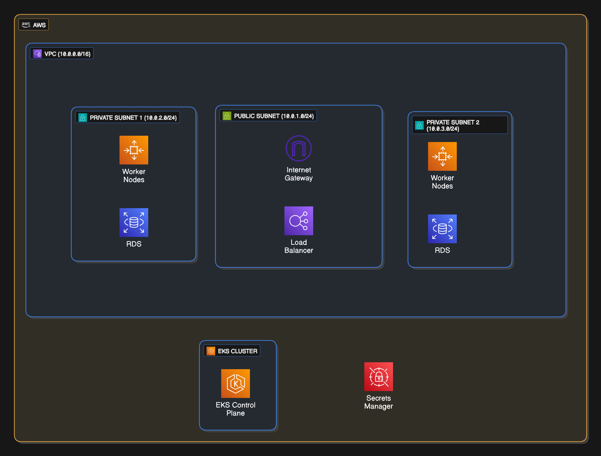

# EKS Cluster Setup

## Objectives

- Deploy an EKS cluster inside a VPC with security-grained subnets
- Use terraform modules to simplify configuration and maintenance
- Enable IRSA
- Integrate with external components like RDS and Secrets Manager

## Architecture

### VPC CIDR 10.0.0.0/16

- CIDR defines network scale/ip address range
- 16 gives thousands of ips
- 16 = first 16 bits are fixed (10.0), rest are allocatable (0.0)

### Private & Public Subnet Configuration

- Public: 10.0.1.0/24
- Private: 10.0.2.0/24 & 10.0.3.0/24

Partitions the subnets into /24 IPS so each subnet has its own IP address range to reserve
Routing tables are applied to subnets, not IPs, so without /24 allocation routing/NAT cannot be set
one public subnet for internet exposure
two private subnets to host worker nodes and RDS DB and any isolated critical components

See [terraform/eks](terraform/eks) for more details
