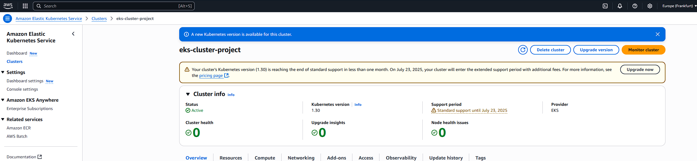
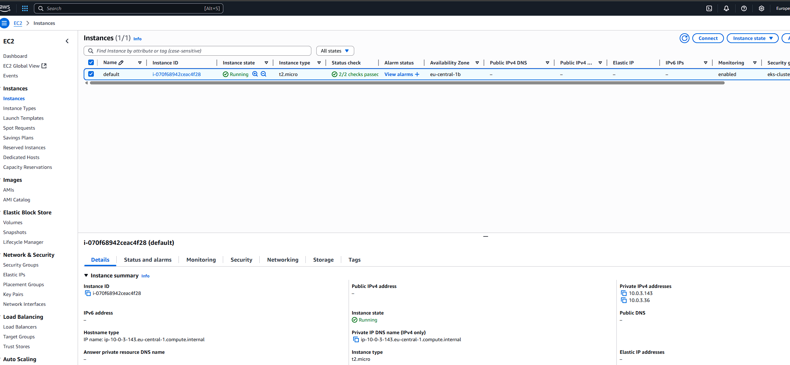
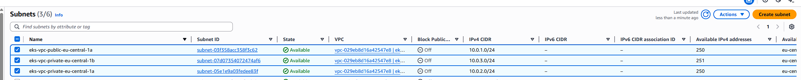
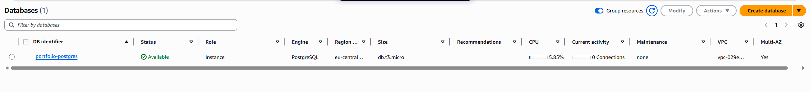
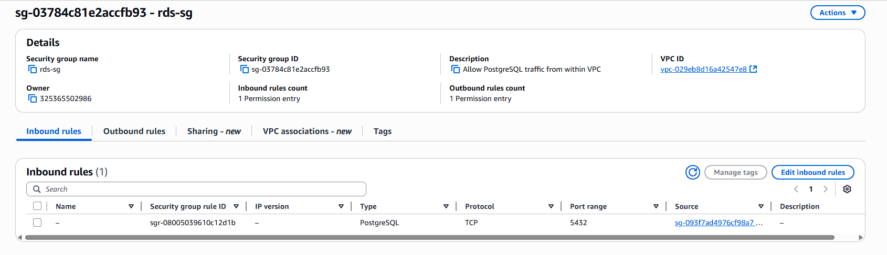
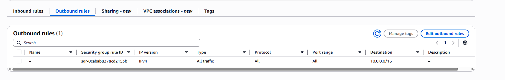

# Live Resource Screenshots

## EKS

> EKS View from AWS Console

## EC2 Worker Nodes

> Worker nodes running in EC2 instances

## Subnet

> Provisioned subnet view from AWS Console

## RDS

> RDS View from AWS Console

## Security Group

> Security group used for RDS
