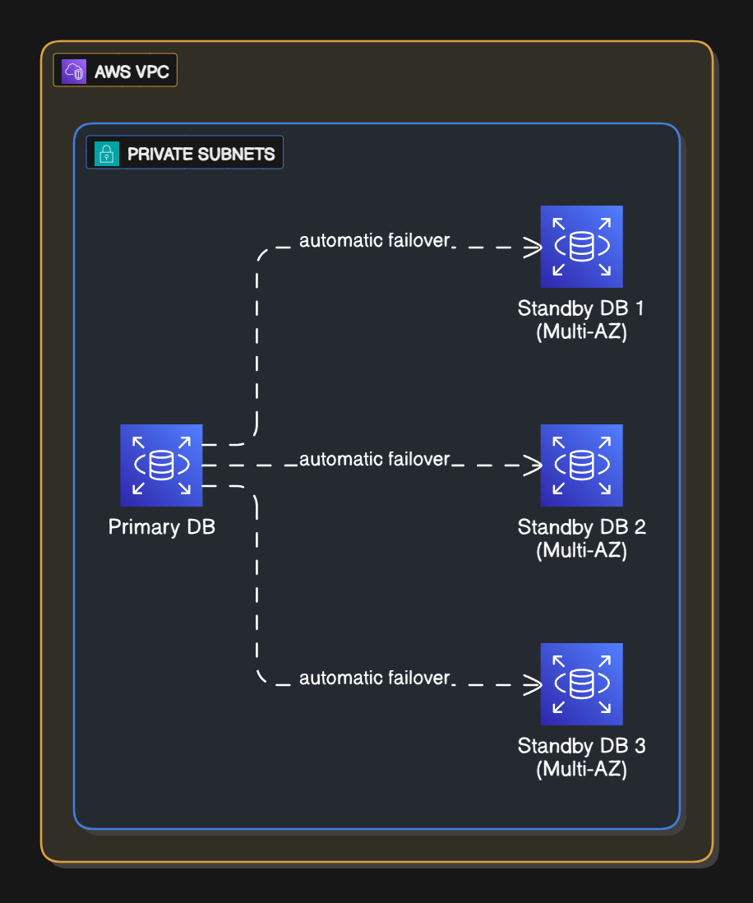

# RDS PostgreSQL Setup

## Objectives

- Provision a **PostgreSQL database** inside **private subnets**
- Enable **Multi-AZ failover** for high availability
- Restrict access by configuring ingress/egress traffic
- Store secrets in **AWS Secrets Manager**

## Networking

The RDS instance is deployed in **private subnets**, isolated from the internet. This ensures that:

- The DB is **not publicly accessible**
- Only **trusted resources inside the VPC** can connect
- Access is fine-grained by **security groups**

## High Availability & Disaster Recovery

- Set up by the below field to enable automatic failover to another Availability Zone in case of failure

````hcl
multi_az = true
```

## Deletion Protection

- RDS deletion protection is disabled for project purposes, but in production it should be enabled to prevent accidental loss by terraform destroy

```hcl
deletion_protection = true
```

## Backup

- Reatins daily backups for 7 days, managed by AWS and setup by field:

```hcl
backup_retention_period = 7
```



See [terraform/rds](terraform/rds) for more details
````
