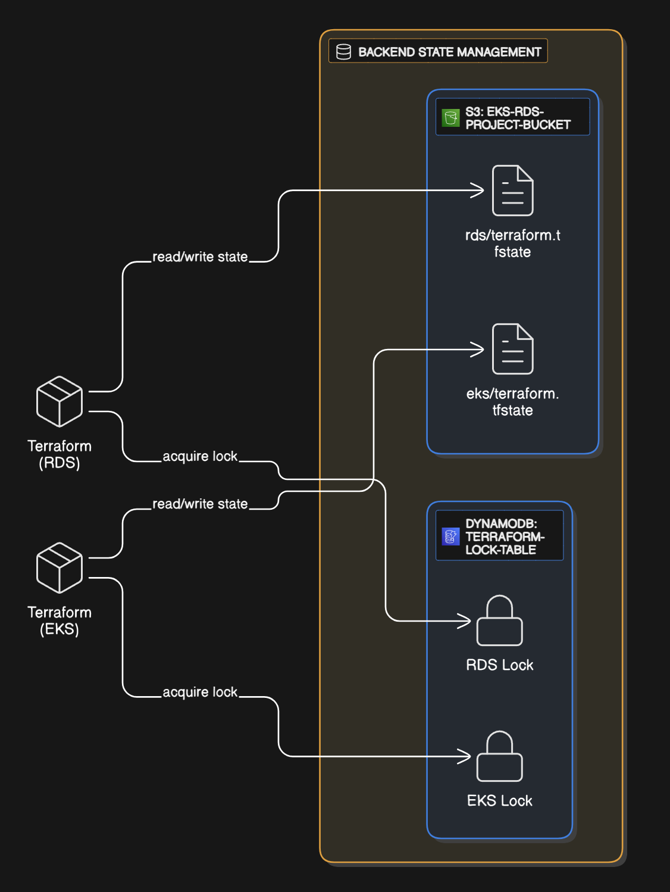

# Terrafom S3 Backend Setup

This project uses an **S3 backend** with **DynamoDB locking** to store and manage Terraform state securely and safely.

## Configuration

Below commands configure resources needed for S3 state locking using AWS CLI

```bash
aws s3api create-bucket \
  --bucket eks-rds-project-bucket \
  --region eu-central-1
```

> To create S3 bucket

```bash
aws s3api put-bucket-versioning \
  --bucket eks-rds-project-bucket \
  --versioning-configuration Status=Enabled
```

> Enables versioning

```bash
aws dynamodb create-table \
  --table-name terraform-lock-table \
  --attribute-definitions AttributeName=LockID,AttributeType=S \
  --key-schema AttributeName=LockID,KeyType=HASH \
  --provisioned-throughput ReadCapacityUnits=1,WriteCapacityUnits=1
```

> Creates DynamoDB table for state locking so that only one person can write to terraform state at the same time

## TF Usage

State is referenced in each module's backend.tf

- [eks-backend](../terraform/eks/backend.tf)
- [rds-backend](../terraform/rds/backend.tf)

## Modular State Setup

- Enables modularization and operation of infrastructure
- Manage EKS and RDS independently
- Easier to reuse or destroy only the RDS component without affecting EKS
- Separation is defined by a different key value pair to store the state in


