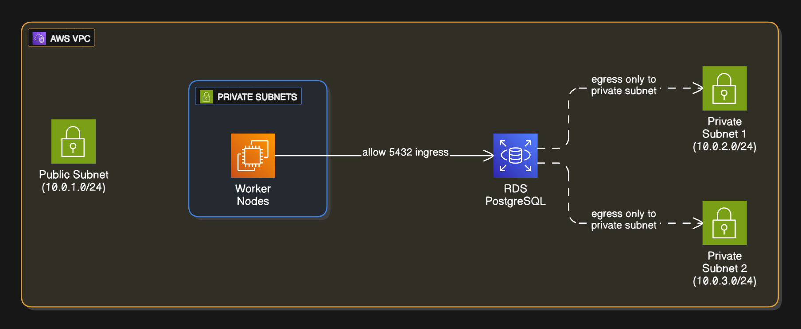

# Security Configuration

## IAM and AWS RBAC

The EKS module enables IRSA (IAM Roles for Service Accounts):

```hcl
enable_irsa = true
```

The EKS module also creates:

- Cluster IAM role
- Node IAM role

In result, K8S pods and worker nodes can access AWS services securely

- Nodes EC2 instances and are considered AWS-native resources, meaning the only need an IAM
- Pods are not AWS-native, meaning that AWS cannot identify a pod without IRSA providing AWS Identity

## Security Groups

- RDS only allows EKS worker nodes to connect on port 5432 (ingress)
- DB egress is restricted only to private subnet CIDR range (locked-down environment simulation)
- Ensures RDS is not publicly accessible, and only trusted workloads can connect

## Secrets Management

- DB credentials are stored in AWS Secrets Manager
- No hardcoded, code commited or dynamically passed data


